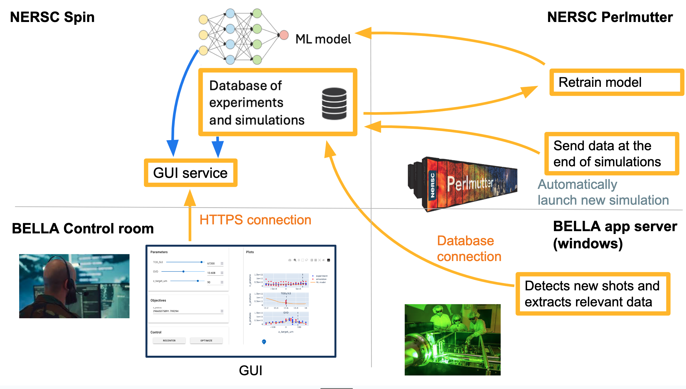

# SYNergistic software platform for AI, Physics Simulations, and Experiments (SYNAPSE)

## Overview of the repository

This repo contains scripts and code to show ML predictions from simulations and experimental data, in the BELLA control room, as illustrated schematically here:

One of the main component is the app that runs on NERSC Spin, for which the code is in the [`dashboard/`](dashboard/) folder. In particular, when running on NERSC Spin, the app needs to access to different sources of information, for different functionalities:

### To display predictions

The app needs the following:

- **Configuration file**: this defines the list of experiments supported by the app, and the input and output quantities for each experiment. It is located at [dashboard/config/variables.yml](dashboard/config/variables.yml).
- **Simulation and experimental data points**: each data points consists of a set of values for the scalar inputs and scalar outputs defined in the above-mentioned configuration file. These points are stored in a MongoDB database, with each experiment being a separate collection in that database. Experimental and simulation datapoints are stored in the same collection, and are distinguished by the attribute `experimental_flag`.
- **ML models**: Models that interpolate in-between datapoints. They are stored in the MongoDB database, in a special collection named `models`.
- **Simulation movies** (optional): for some experiments, the user can click on simulation datapoints and see a movie of the simulation pop up. The corresponding MP4 files are stored on the NERSC shared file system, in the folder `/global/cfs/cdirs/m558/superfacility/simulation_data`. This folder is then mounted on the image that runs on NERSC Spin.

### To launch ML training at NERSC

Retraining of models is done at NERSC using the SFAPI. The app needs the following:

- **SFAPI credential file:** See [dashboard/README.md](dashboard/README.md) for instructions on how to generate the credential file and upload it into the Spin app.
- **Submission script**: See [ml/training_pm.sbatch](ml/training_pm.sbatch). This file is copied into the Docker image that is pushed to Spin (see [dashboard/Dockerfile](dashboard/Dockerfile)), and is used as a template to form the SFAPI job submission, whenever the user requests training via the dashboard.
- **Python scripts, and configuration files**: See [ml/train_model.py](ml/train_model.py), [ml/Neural_Net_Classes.py](ml/Neural_Net_Classes.py) and [dashboard/config/variables.yml](dashboard/config/variables.yml). These files are copied into the Docker image that is pushed to Spin (see [dashboard/Dockerfile](dashboard/Dockerfile)). Whenever the user requests training via the dashboard, these files are then copied to the Perlmutter shared file system (CFS) (in the folder `/global/cfs/cdirs/m558/superfacility/model_training/src/`), so that the Perlmutter job launched with the SFAPI can find these files.
