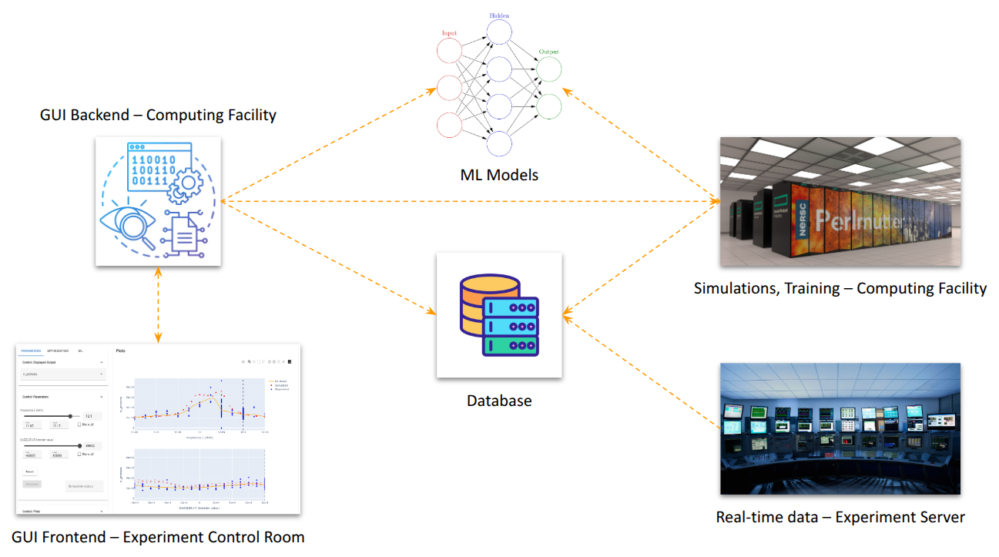

# Synergistic Software Platform for AI, Physics Simulations, and Experiments (Synapse)

## Overview

Synapse is a software platform that enables experimental physicists in a control room to couple experimental data, simulations, and machine learning (ML) models trained on experimental data and simulations, as illustrated schematically here for the case of the Berkeley Lab Laser Accelerator Center (BELLA):

One of the main software component is the graphical user interface (GUI) deployed via [Spin](https://docs.nersc.gov/services/spin/) at NERSC.
The application needs to access to a variety of data and information, as described in the following sections.

### To display ML predictions

The application needs the following:

- **Experiment configuration file**: YAML file named `config.yaml` saved in the root directory of a given experiment's repository.
It defines input, output, and calibration variables for the experiment.
- **Simulation and experimental data points**: Each data point consists of a set of values for the scalar inputs and scalar outputs defined in the experiment configuration file.
The data points are stored in a MongoDB database, where each experiment is represented by a separate collection.
Experimental and simulation data points are stored in the same collection, and are distinguished by the attribute `experimental_flag`.
- **ML models**: ML models that interpolate in-between data points.
They are stored in the MongoDB database in a separate collection named `models`.
- **Simulation movies** (optional): For some experiments, users can click on simulation data points and visualize a movie of the simulation.
The corresponding MP4 files are stored on the NERSC shared file system in the directory `/global/cfs/cdirs/m558/superfacility/simulation_data`.
This directory is mounted on the container image that runs on Spin.

### To launch ML training at NERSC

ML models training can be submitted as a NERSC job from the GUI via the [NERSC Superfacility API](https://docs.nersc.gov/services/sfapi/).
The application needs the following:

- **Superfacility API credential file**: See [dashboard/README.md](dashboard/README.md) for instructions on how to generate the credential file and upload it from the GUI.
- **Submission script**: See [ml/training_pm.sbatch](ml/training_pm.sbatch).
This file is copied into the container image that is pushed to the NERSC registry and deployed via Spin (see [dashboard/Dockerfile](dashboard/Dockerfile)), and it is used as a template for the Superfacility API job submission, whenever the user launches model training from the GUI.
- **Python scripts and configuration files**: See [ml/train_model.py](ml/train_model.py), [ml/Neural_Net_Classes.py](ml/Neural_Net_Classes.py) and [dashboard/config/variables.yml](dashboard/config/variables.yml).
These files are copied into the container image that is pushed to the NERSC registry and deployed via Spin (see [dashboard/Dockerfile](dashboard/Dockerfile)).
Whenever the user launches model training from the GUI, these files are copied to the Perlmutter shared file system (CFS) (in the directory `/global/cfs/cdirs/m558/superfacility/model_training/src/`), so that the job launched via the Superfacility API can find these files.

## Copyright Notice and License Agreement

Synapse v1.0 Copyright (c) 2025, The Regents of the University of California,
through Lawrence Berkeley National Laboratory (subject to receipt of
any required approvals from the U.S. Dept. of Energy). All rights reserved.

If you have questions about your rights to use or distribute this software,
please contact Berkeley Lab's Intellectual Property Office at
IPO@lbl.gov.

Please find the full copyright notice in [NOTICE.txt](NOTICE.txt) and the full license agreement in [LICENSE.txt](LICENSE.txt).

The SPDX license identifier is `BSD-3-Clause-LBNL`.
